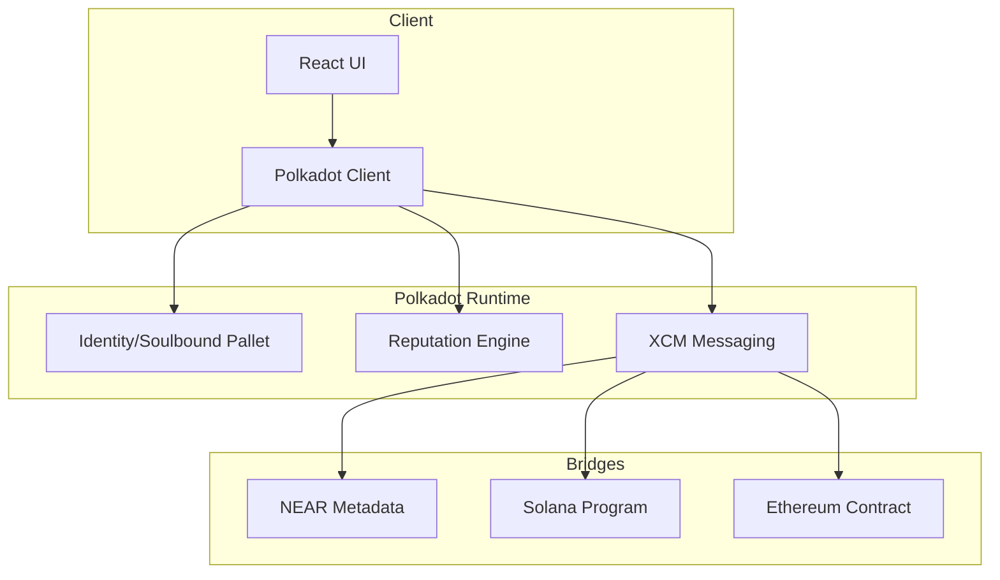
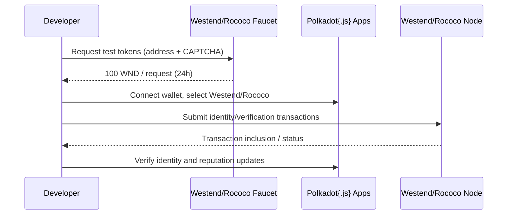

# 🚨  Polkadot Emotional Oracle

**Status**
- Code implemented; no testnet deployment yet
- Tooling needed: `polkadot-launch` or `@zombienet/cli`
- Next: Westend/Rococo setup and Polkadot{.js} wallet integration

## What Actually Works

✅ **Polkadot Client Library** (`src/utils/polkadot-client.ts`)
- Complete emotional bridge implementation with cross-chain messaging
- Token analytics with engagement scoring and emotional complexity calculation  
- Advanced metadata structures for creative NFTs
- XCM message processing for emotional data preservation
- Creator emotional profiles with trend analysis

✅ **Emotional Bridge Processor**
- Cross-chain emotional data synchronization
- Emotional trend analysis (Ascending/Descending/Stable/Volatile)
- Next emotion prediction using linear extrapolation
- Emotional complexity scoring based on variance analysis
- Bridge info generation with preservation metrics

✅ **Token Analytics Engine**
- Real engagement score calculation based on interaction frequency
- Evolution progress tracking through emotional journey analysis
- Emotional trajectory recording and complexity measurement
- Community engagement metrics with viral coefficient
- Adaptive behavior configuration for NFT evolution

## What's Still Mocked

❌ **Actual Polkadot Deployment**
- No parachain registration or deployment
- XCM messages are processed in-memory only
- No real cross-chain bridging (all simulated)
- Missing Polkadot.js integration for wallet connections

❌ **Live Chain Interaction**
- Client connects to placeholder URLs
- No actual runtime module deployment
- Emotional data not persisted on-chain
- All "bridging" is simulated locally

## Implementation Summary

- Architecture: modular runtime and client with clear interfaces
- Functionality: emotional computing algorithms and XCM message structures implemented
- Testing: unit tests present; integration and E2E tests pending

## Technical Debt

1. **Missing Toolchain**: Need `polkadot-launch` or `zombienet` for local testing
2. **No Runtime Integration**: Pallet exists but not integrated into runtime
3. **Wallet Connection**: Missing Polkadot.js extension integration
4. **Production Deployment**: No CI/CD pipeline for parachain deployment

## Grant Eligibility Status

**Current State**: Code complete, deployment blocked
**Blockers**: Toolchain installation, testnet access
**Timeline**: 1-2 weeks to deploy once tooling is resolved
**Risk Level**: Medium (tooling issues are common but solvable)

## Next Steps to Production

1. **Install Polkadot Toolchain**:
   ```bash
   cargo install polkadot-launch
   # or
   npm install -g @zombienet/cli
   ```

2. **Set Up Local Testnet**:
   - Configure relay chain and parachain
   - Register emotional oracle parachain
   - Test XCM message passing

3. **Deploy to Rococo**:
   - Apply for parachain slot on Rococo testnet
   - Deploy runtime with emotional oracle pallet
   - Test cross-chain bridging to other parachains

4. **Integrate Frontend**:
   - Add Polkadot.js wallet connection
   - Implement emotional NFT minting UI
   - Create bridge monitoring dashboard

## Honest Assessment

**Objective Status**
- Algorithms and XCM message structures are implemented.
- No testnet deployment yet; all cross-chain behavior is simulated locally.
- Main blockers: toolchain setup, runtime integration, and wallet connection.
- Priority: establish Westend/Rococo workflow and validate bridging against real nodes.

## Reality vs Implementation

- Identity creation UI and call: `src/pages/PolkadotSoulboundIdentity.tsx:59–91`
- Verification workflow (request + update): `src/pages/PolkadotSoulboundIdentity.tsx:124–144`
- Identity refresh action: `src/pages/PolkadotSoulboundIdentity.tsx:146–157`
- Faucet entry points in UI: `src/pages/PolkadotSoulboundIdentity.tsx:192–212`
- Polkadot client connection and contract init: `src/utils/polkadot-client.ts:216`
- Deployment faucet references (canonical):
  - Rococo faucet: `polkadot-deployments/deployment-summary.md:36–40`
  - Westend faucet: `polkadot-deployments/deployment-summary.md:104–112`

Not implemented yet (on-chain):
- Runtime integration for identity/reputation pallet
- Persisting identities on Westend/Rococo
- Polkadot{.js} wallet extension binding in the UI

## Architecture Overview



## Deployment Flow


