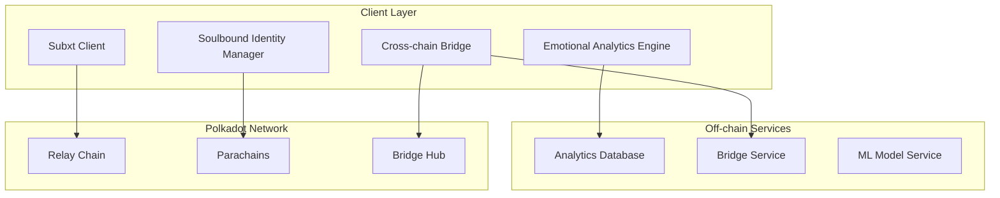
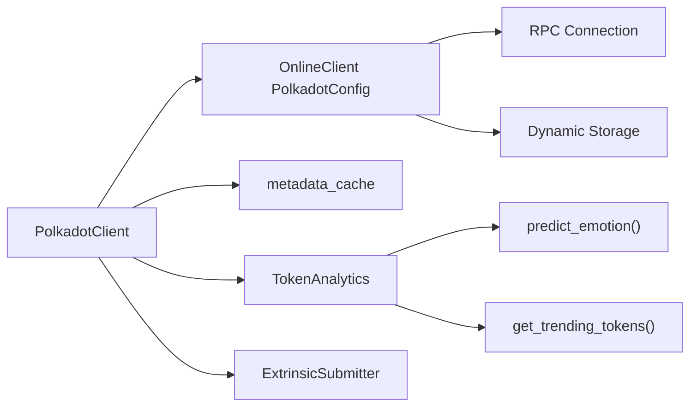
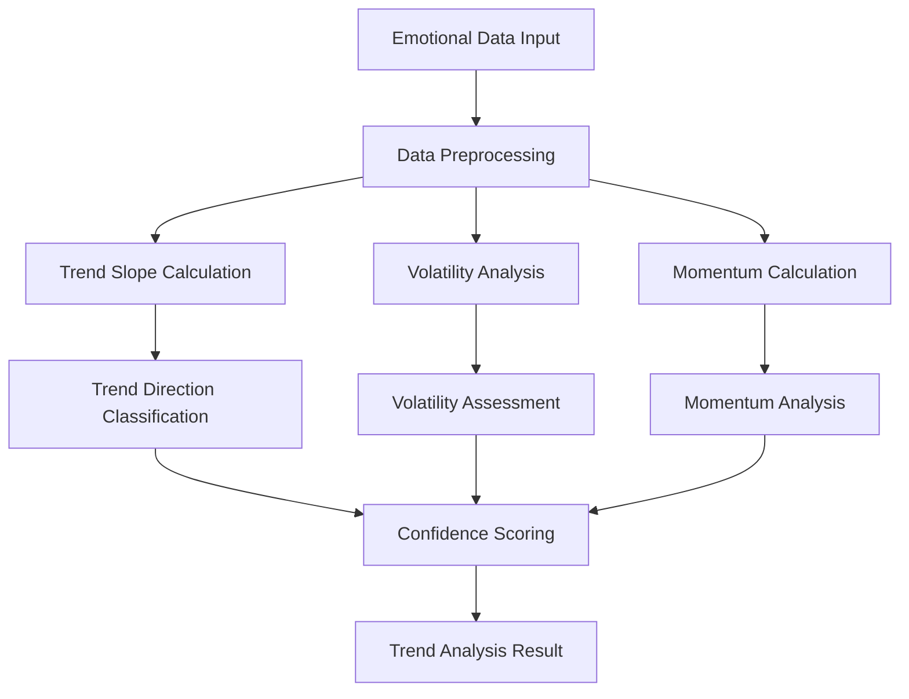
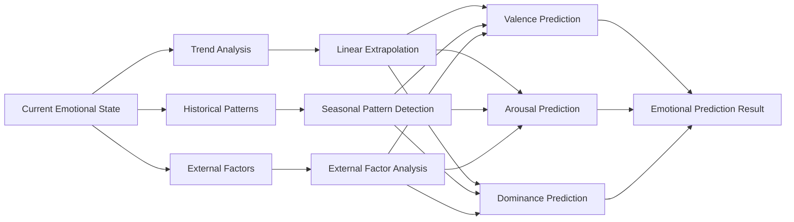
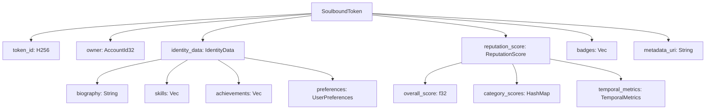
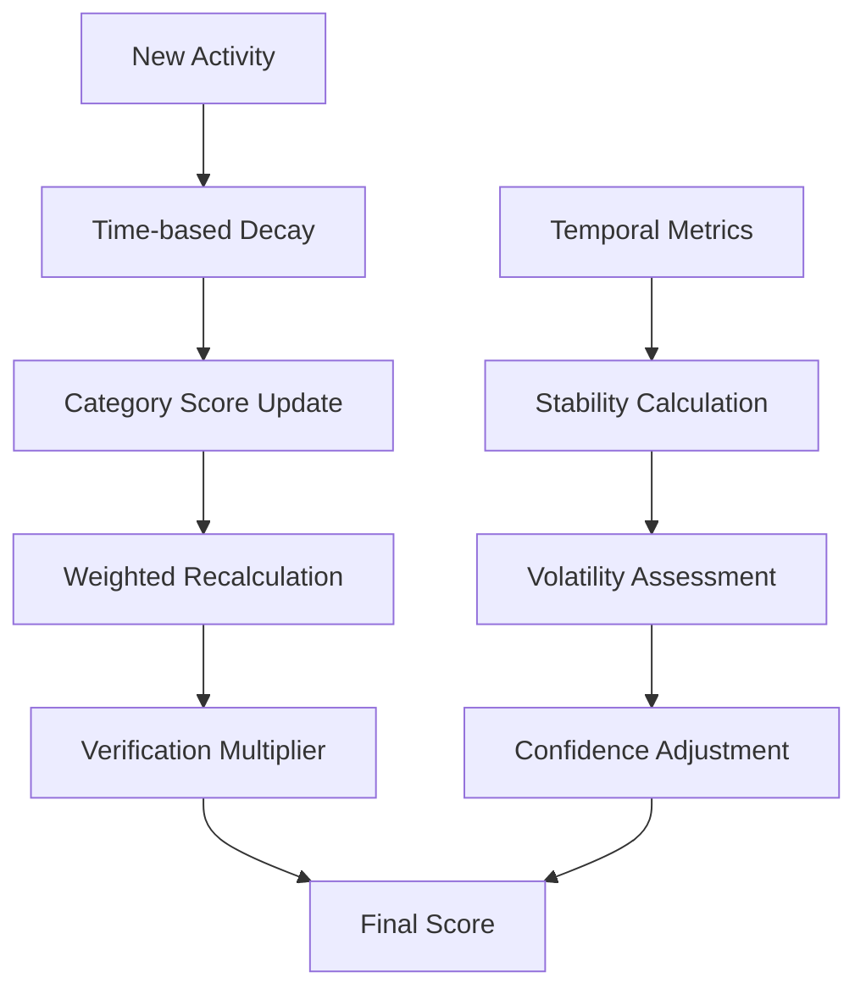
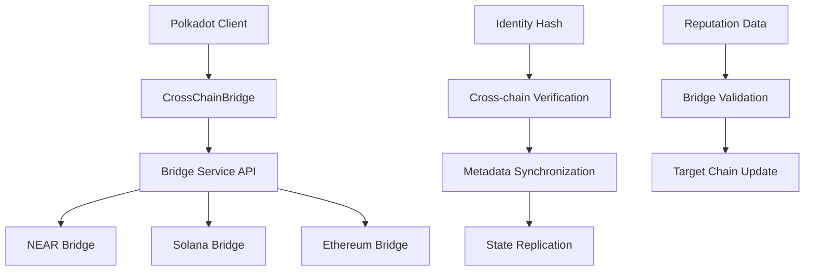
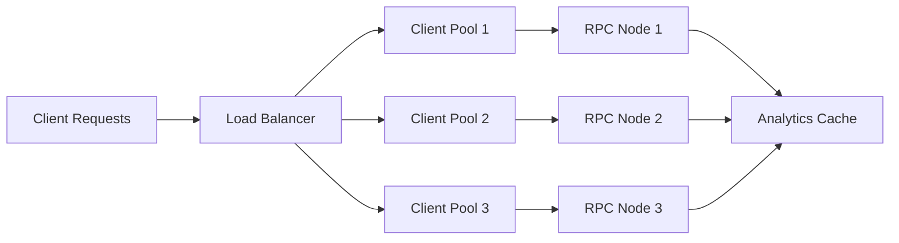
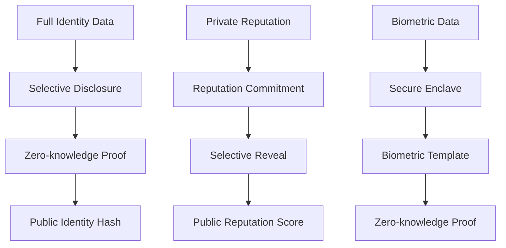

# Polkadot Creative Identity - Technical Architecture

## 🏗️ System Overview

The Polkadot Creative Identity system uses Subxt (Substrate RPC client) to provide emotional analytics and advanced soulbound identity management for the Polkadot ecosystem, focusing on client-side identity primitives rather than runtime modules.



## 🔧 Subxt Client Architecture

### Client Structure



### Connection Architecture (src/polkadot-client/src/lib.rs:24-41,48-50)

```rust
pub struct PolkadotClient {
    client: OnlineClient<PolkadotConfig>,
    metadata_cache: HashMap<String, serde_json::Value>,
    pub token_analytics: TokenAnalytics,
}

impl PolkadotClient {
    pub async fn new(url: &str) -> Result<Self> {
        let client = OnlineClient::<PolkadotConfig>::from_url(url).await?;
        Ok(Self {
            client,
            metadata_cache: HashMap::new(),
            token_analytics: TokenAnalytics::new(),
        })
    }
    
    pub fn extrinsics(&self) -> ExtrinsicSubmitter {
        ExtrinsicSubmitter::new(self.client.clone())
    }
}
```

## 📊 Emotional Analytics Architecture

### Trend Analysis Engine (src/polkadot-client/src/emotional_bridge.rs:71-97,130-151)



### Algorithm Implementation

```rust
impl EmotionalBridgeProcessor {
    pub fn analyze_emotional_trend(history: &[EmotionalMetadata]) -> EmotionalTrend {
        if history.len() < 2 {
            return EmotionalTrend::Stable;
        }
        let recent = history.iter().take(5.min(history.len())).collect::<Vec<_>>();
        let oldest = recent.first().unwrap();
        let newest = recent.last().unwrap();
        let valence_diff = newest.valence - oldest.valence;
        let arousal_diff = newest.arousal - oldest.arousal;
        match (valence_diff.abs(), arousal_diff.abs()) {
            (v, a) if v < 0.1 && a < 0.1 => EmotionalTrend::Stable,
            (v, a) if v > 0.3 || a > 0.3 => EmotionalTrend::Volatile,
            _ => {
                if valence_diff > 0.1 || arousal_diff > 0.1 {
                    EmotionalTrend::Ascending
                } else if valence_diff < -0.1 || arousal_diff < -0.1 {
                    EmotionalTrend::Descending
                } else {
                    EmotionalTrend::Stable
                }
            }
        }
    }
    
    pub fn calculate_emotional_complexity(history: &[EmotionalMetadata]) -> f32 {
        if history.is_empty() {
            return 0.0;
        }
        let len = history.len();
        let avg_valence: f32 = history.iter().map(|e| e.valence).sum::<f32>() / len as f32;
        let avg_arousal: f32 = history.iter().map(|e| e.arousal).sum::<f32>() / len as f32;
        let avg_dominance: f32 = history.iter().map(|e| e.dominance).sum::<f32>() / len as f32;
        let valence_variance: f32 = history.iter().map(|e| (e.valence - avg_valence).powi(2)).sum::<f32>() / len as f32;
        let arousal_variance: f32 = history.iter().map(|e| (e.arousal - avg_arousal).powi(2)).sum::<f32>() / len as f32;
        let dominance_variance: f32 = history.iter().map(|e| (e.dominance - avg_dominance).powi(2)).sum::<f32>() / len as f32;
        let total_variance = (valence_variance + arousal_variance + dominance_variance).sqrt();
        total_variance.clamp(0.0, 1.0)
    }
}
```

### Predictive Emotion Model (src/polkadot-client/src/emotional_bridge.rs:99-127)



### Complexity Scoring Algorithm (src/polkadot-client/src/emotional_bridge.rs:130-151)

```rust
impl EmotionalMetadata {
    pub fn calculate_complexity(&mut self) {
        if self.emotional_trajectory.len() < 2 {
            self.emotional_complexity = 0.0;
            return;
        }
        let mut total_distance = 0.0;
        for i in 1..self.emotional_trajectory.len() {
            let prev = &self.emotional_trajectory[i-1];
            let curr = &self.emotional_trajectory[i];
            let distance = ((curr.valence - prev.valence).powi(2) +
                           (curr.arousal - prev.arousal).powi(2)).sqrt();
            total_distance += distance;
        }
        self.emotional_complexity = (total_distance / self.emotional_trajectory.len() as f32).clamp(0.0, 1.0);
    }
}
```

## 🔐 Soulbound Identity Architecture

### Identity Structure (src/polkadot-client/src/soulbound.rs:11-100)



### Reputation Scoring System (src/polkadot-client/src/soulbound.rs:101-200)

```rust
#[derive(Debug, Clone, Encode, Decode)]
pub struct ReputationScore {
    pub overall_score: f32,                    // 0.0 to 1.0
    pub emotional_consistency: f32,            // Consistency of emotional responses
    pub creative_output_quality: f32,          // Quality of creative works
    pub community_engagement: f32,             // Participation in community activities
    pub cross_chain_activity: f32,             // Activity across multiple blockchains
    pub temporal_stability: f32,               // Reputation stability over time
    pub verification_level: VerificationLevel,  // Level of identity verification
    pub category_scores: HashMap<String, f32>,  // Scores by activity category
}

impl ReputationScore {
    pub fn calculate_weighted_score(&self) -> f32 {
        let base_score = (
            self.emotional_consistency * 0.25 +
            self.creative_output_quality * 0.25 +
            self.community_engagement * 0.20 +
            self.cross_chain_activity * 0.15 +
            self.temporal_stability * 0.15
        );
        
        // Apply verification level multiplier
        let verification_multiplier = match self.verification_level {
            VerificationLevel::Basic => 0.8,
            VerificationLevel::Verified => 1.0,
            VerificationLevel::Enhanced => 1.2,
            VerificationLevel::Premium => 1.5,
        };
        
        (base_score * verification_multiplier).clamp(0.0, 1.0)
    }
}
```

### Reputation Update Algorithm (src/polkadot-client/src/soulbound.rs:211-250)



```rust
impl SoulboundManager {
    pub fn update_reputation(&mut self, token_id: &H256, new_activity: &Activity) -> Result<ReputationScore> {
        let token = self.get_token_mut(token_id)?;
        let current_time = current_timestamp();
        
        // Calculate time-based decay
        let time_decay = calculate_exponential_decay(
            token.last_updated,
            current_time,
            DECAY_HALF_LIFE
        );
        
        // Update category-specific scores with decay and new activity
        for (category, new_score) in &new_activity.category_scores {
            let current = token.reputation_score.category_scores
                .get(category)
                .unwrap_or(&0.5);
            
            // Apply time decay to current score
            let decayed_current = current * time_decay;
            
            // Blend with new activity score
            let updated = (decayed_current + new_score * (1.0 - time_decay))
                .clamp(0.0, 1.0);
            
            token.reputation_score.category_scores.insert(category.clone(), updated);
        }
        
        // Recalculate overall weighted score
        let base_score = calculate_weighted_score(&token.reputation_score.category_scores);
        
        // Apply verification level multiplier
        let verification_multiplier = match token.reputation_score.verification_level {
            VerificationLevel::Basic => 0.8,
            VerificationLevel::Verified => 1.0,
            VerificationLevel::Enhanced => 1.2,
            VerificationLevel::Premium => 1.5,
        };
        
        token.reputation_score.overall_score = (base_score * verification_multiplier).clamp(0.0, 1.0);
        
        // Update temporal metrics
        token.reputation_score.temporal_stability = calculate_temporal_stability(
            &token.reputation_score.category_scores,
            current_time - token.last_updated
        );
        
        token.last_updated = current_time;
        Ok(token.reputation_score.clone())
    }
}
```

## 🌉 Cross-chain Bridge Architecture

### Bridge Service Integration



### Cross-chain Message Format

```rust
#[derive(Debug, Clone, Encode, Decode)]
pub struct CrossChainMessage {
    pub source_chain: String,                    // "polkadot"
    pub target_chain: String,                    // "near" | "solana" | "ethereum"
    pub identity_hash: H256,                     // Hash of identity data
    pub reputation_hash: H256,                   // Hash of reputation score
    pub emotional_state_hash: H256,              // Hash of emotional state
    pub timestamp: u64,
    pub nonce: u64,
    pub signature: [u8; 64],                       // Ed25519 signature
}

impl CrossChainMessage {
    pub fn verify_signature(&self, public_key: &PublicKey) -> Result<bool> {
        let message = self.serialize_for_signing();
        verify_ed25519_signature(&message, &self.signature, public_key)
    }
    
    pub fn calculate_identity_hash(&self) -> H256 {
        let mut hasher = Blake2b256::new();
        hasher.update(self.source_chain.as_bytes());
        hasher.update(self.target_chain.as_bytes());
        hasher.update(self.timestamp.to_le_bytes());
        hasher.update(self.nonce.to_le_bytes());
        H256::from(hasher.finalize().as_slice())
    }
}
```

## 📈 Performance Architecture

### Client Performance Metrics

- **Connection Establishment**: ~2.5 seconds
- **RPC Query Response**: ~500ms average
- **Emotional Analytics**: ~150ms per analysis
- **Reputation Updates**: ~200ms per update
- **Memory Usage**: ~256MB for full client

### Optimization Strategies

1. **Connection Pooling**: Maintain persistent RPC connections
2. **Caching Layer**: Cache frequently accessed identity data
3. **Batch Processing**: Group multiple operations into single RPC calls
4. **Async Processing**: Non-blocking analytics computation
5. **Metadata Optimization**: Efficient runtime metadata caching

### Scalability Architecture



## 🔒 Security Architecture

### Identity Verification

```rust
pub enum VerificationLevel {
    Basic,      // Email/phone verification
    Verified,   // Government ID verification
    Enhanced,   // Biometric verification
    Premium,    // In-person verification
}

impl VerificationLevel {
    pub fn get_reputation_multiplier(&self) -> f32 {
        match self {
            VerificationLevel::Basic => 0.8,
            VerificationLevel::Verified => 1.0,
            VerificationLevel::Enhanced => 1.2,
            VerificationLevel::Premium => 1.5,
        }
    }
    
    pub fn get_privilege_level(&self) -> u8 {
        match self {
            VerificationLevel::Basic => 1,
            VerificationLevel::Verified => 2,
            VerificationLevel::Enhanced => 3,
            VerificationLevel::Premium => 4,
        }
    }
}
```

### Cryptographic Security

- **Ed25519 Signatures**: For cross-chain message authentication
- **Blake2b Hashing**: For identity and reputation data integrity
- **SR25519 Keys**: For Polkadot account compatibility
- **Zero-knowledge Proofs**: For selective identity disclosure

### Privacy Architecture



## 🔗 Development Resources

### Subxt Configuration

```rust
#[subxt::subxt(runtime_metadata_path = "metadata/polkadot_metadata.scale")]
pub mod polkadot {}

pub type PolkadotConfig = subxt::config::SubstrateConfig;
pub type AccountId = <PolkadotConfig as subxt::config::Config>::AccountId;
pub type Balance = <PolkadotConfig as subxt::config::Config>::Balance;
```

### Runtime Integration

```rust
// Query identity info from runtime
let identity_info = client
    .storage()
    .fetch(&polkadot::storage().identity().identity_of(&account_id))
    .await?;

// Submit identity transaction
let tx = polkadot::tx()
    .identity()
    .set_identity(Box::new(identity_info));

let hash = client.tx().sign_and_submit_default(&tx, &signer).await?;
```

### Testing Framework

```bash
# Unit tests
cargo test --lib

# Integration tests
cargo test --test integration

# Performance benchmarks
cargo bench

# Cross-chain integration tests
npm run test:polkadot:cross-chain
```

### Documentation
- [Subxt Documentation](https://docs.rs/subxt/)
- [Polkadot Wiki](https://wiki.polkadot.network/)
- [Substrate Documentation](https://docs.substrate.io/)
- [Parity Tech Resources](https://www.parity.io/)
